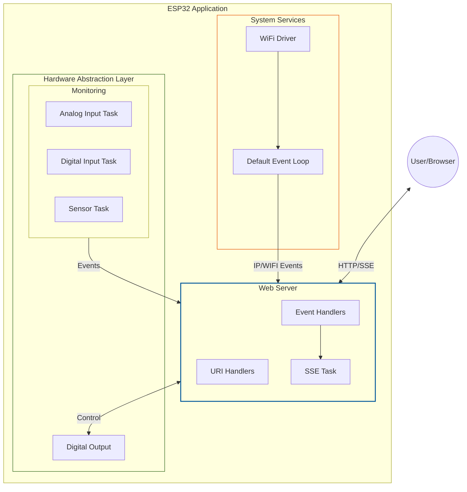

# FreeRTOS + ESP32: Embedded Systems Programming

This repository contains the source code for an academic extension project on embedded systems using **FreeRTOS** and **ESP32**.

The project demonstrates core RTOS concepts such as multitasking, real-time scheduling, and inter-task communication. The final output is a web dashboard hosted directly on the ESP32, enabling real-time monitoring and control through an asynchronous architecture.

Part of [*The Parallel Computing School: Short Courses and Tutorials*](https://github.com/rogerioag/ecp-minicursos).

## Tech Stack

**Firmware:**  
[](https://www.w3schools.com/c/c_intro.php)
[](https://www.espressif.com/en/products/socs/esp32)
[](https://docs.espressif.com/projects/esp-idf/en/latest/esp32/)

**Frontend:**  
[](https://www.typescriptlang.org/)
[](https://sass-lang.com/)
[](https://webpack.js.org/)
[](https://developer.mozilla.org/en-US/docs/Web/API/Web_components)
[](https://nodejs.org/)
[](https://expressjs.com/)

The dashboard is built with [Web Components](https://developer.mozilla.org/en-US/docs/Web/API/Web_components) and [Webpack](https://webpack.js.org/) to bundle and minify the project, making it ideal for resource-limited devices like the ESP32.

For more details, see the [Frontend README](./components/web_server/frontend/README.md)

## Hardware Schematic

The wiring and electronic components can be reviewed in the following schematic:


## Architecture

The system utilizes an **Event-Driven Architecture (EDA)** to maximize responsiveness and minimize resource consumption.

- **Real-Time Monitoring**: Instead of traditional HTTP polling, this project implements **Server-Sent Events (SSE)**. This allows the ESP32 to push sensor updates to the frontend instantly as they happen, significantly reducing network traffic and latency.
- **Non-Blocking Hardware Abstraction**: Each hardware peripheral (Analog, Digital, Sensors) operates in its own dedicated FreeRTOS task. They communicate with the Web Server via asynchronous events, ensuring that a slow sensor read never freezes the UI or the WiFi stack.



## Build and Flash

The project is configured to handle the frontend assets automatically during the firmware compilation process.

 1. **Prerequisites**: Ensure you have the ESP-IDF SDK installed and configured.

 2. **Compilation**: Run the following command in the root directory:
    ```bash
    idf.py build
    ```
    > This will trigger the Webpack build for the frontend and embed the resulting files into the firmware.

 3. **Flash**:
    ```bash
     idf.py -p [PORT] flash monitor
    ```

## Demonstration

Once the device is flashed, monitor the serial output to find the assigned IP address. Open your browser and navigate to that IP.

### Digital Input & Control

Monitor button states and control digital outputs in real-time. 

<video src="https://github.com/user-attachments/assets/47d56d9a-5213-448e-a3d6-8f0649e0f05e" width="1920" controls autoplay loop muted>
  Seu navegador não suporta o player de vídeo.
</video>


### Analog Monitoring

Visualize ADC values and sensor data through dynamic charts. 


### Multiple clients

The system is designed to handle multiple concurrent clients using SSE broadcasting.


